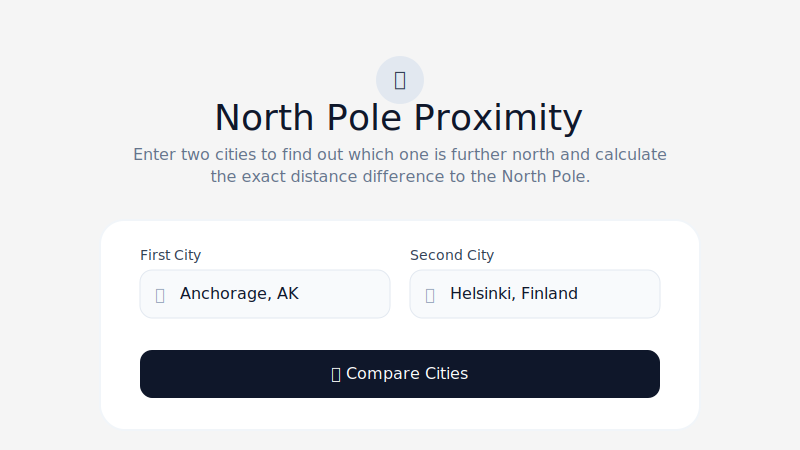
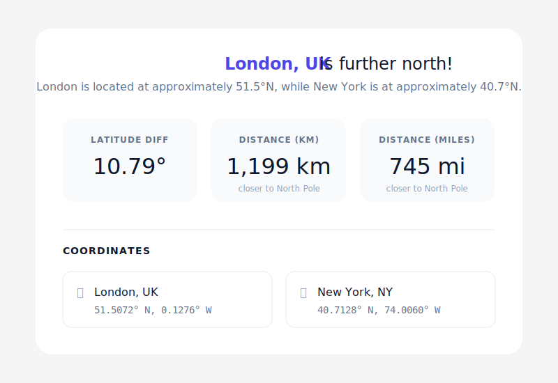

# North Pole Proximity

North Pole Proximity is a web application that allows users to compare two cities and determine which one is located further north (closer to the North Pole). It calculates the exact difference in latitude and provides the distance difference in both kilometers and miles.

## Features

*   **City Comparison:** Enter the names of any two cities worldwide.
*   **AI-Powered Accuracy:** Utilizes the Gemini AI model to accurately determine the geographical coordinates of the specified cities.
*   **Detailed Metrics:** 
    *   Identifies the more northern city.
    *   Calculates the difference in latitude degrees.
    *   Converts the latitude difference into distance (kilometers and miles).
*   **Coordinate Display:** Shows the exact latitude and longitude for both cities for reference.
*   **Responsive Design:** A clean, modern, and mobile-friendly user interface built with Tailwind CSS.

## How it Works

1.  The user enters the names of two cities in the input fields.
2.  Upon clicking "Compare Cities", the app sends a prompt to the Gemini API.
3.  The AI processes the request, retrieves the coordinates, performs the calculations, and returns the data in a structured JSON format.
4.  The app parses the JSON response and displays the results in an easy-to-read dashboard.

## Showcase

Here is an example of how the application looks and functions when comparing two cities:

### 1. Entering Cities
The user enters two cities, for example, "Anchorage, AK" and "Helsinki, Finland".

### 2. Viewing Results
After calculation, the app displays the winner and the detailed metrics.

**Example Output Data:**
*   **Winner:** Anchorage, AK is further north!
*   **Explanation:** Anchorage is located at approximately 61.2°N, while Helsinki is at approximately 60.2°N.
*   **Latitude Diff:** 1.05°
*   **Distance (km):** 116 km closer to North Pole
*   **Distance (miles):** 72 mi closer to North Pole
*   **Coordinates:**
    *   Anchorage, AK: 61.2181° N, 149.9003° W
    *   Helsinki, Finland: 60.1699° N, 24.9384° E

## Technologies Used

*   **Frontend:** React, TypeScript, Tailwind CSS, Lucide React (icons)
*   **AI Integration:** `@google/genai` SDK (Gemini 3.1 Pro Preview model)
*   **Build Tool:** Vite

## Setup Instructions

1.  Clone the repository.
2.  Install dependencies: `npm install`
3.  Set up your environment variables. You will need a Gemini API key. Create a `.env` file based on `.env.example` and add your key: `GEMINI_API_KEY="your_api_key_here"`
4.  Start the development server: `npm run dev`

